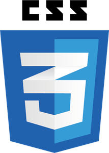

  

<h3 align="center">Clínica Dental</h3>

---

## 📝 Table of Contents

- [About](#about)
- [Getting Started](#getting_started)
- [Usage](#usage)
- [Built Using](#built_using)
- [Authors](#authors)
- [Acknowledgments](#acknowledgement)

## 🧐 About 

We have created an application about a fictitious dental clinic.
In it you can register as a client and, once registered, you log in to see your data in a profile view and you can make an appointment by choosing the day, time and dentist.
In the user profile you can delete appointments from the client himself.
It has an Administrator view, in which you can see all the appointments that the clinic has and all the clients that the clinic has.

## 🏁 Getting Started 

First of all we start the terminal of our code editor, in my case the Virtual Studio Code, and we start the default package management system for Node.js (npm) with the text npm init. Then we installed Express, MySql, Sequelize and Nodemon. All this to build the server and have a database.
Once we have the BackEnd raised, we have to raise the FrontEnd with an npm start.

## ⛏️ Built Using 

    
    
    
    
    
    
     
     
     
     
     

## ✍️ Authors 

- [@joanbatiste](https://github.com/joanbatiste) - Idea & Work
- [@carlosval](https://github.com/Carlos-Val) - Idea & Work

## 🎉 Acknowledgements 

-  I would like to thank all the classmates for the help they have offered us to be able to finish this project successfully. Without them this would not have happened. Thank you very much people and a lot of chill
